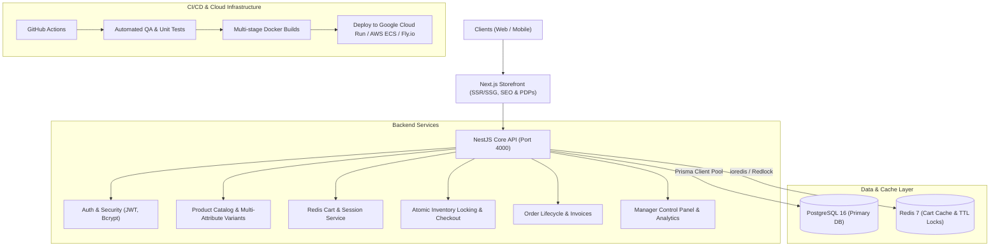

# 🎨 M/S Rong Bahar – Enterprise Cloud-Native Hardware & Paint Superstore

A production-grade, distributed e-commerce platform engineered for **M/S Rong Bahar** (Pakundia Bazar, Kishoreganj, Bangladesh). Built with Next.js (TypeScript) for SEO-optimized storefronts and dynamic Product Detail Pages (PDP), NestJS for high-concurrency cart and checkout management, PostgreSQL as the primary ACID relational database, Redis for in-memory session caching and temporary inventory reservation locking, and GitHub Actions CI/CD for automated Dockerized deployment to Google Cloud Run, AWS ECS, or Fly.io.

---

## 🏛️ System Architecture



---

## 📦 Tech Stack & Features

| Layer | Technology | Key Capabilities |
| :--- | :--- | :--- |
| **Frontend** | Next.js (TypeScript, App Router, TailwindCSS) | Dynamic SEO metadata, JSON-LD Schema (`Product`, `Offer`), 3D Object Color Visualizer, ☀️ Day & 🌙 Night High-Contrast Color Grading, Multi-Attribute Variant PDPs |
| **Backend** | NestJS (Node.js, TypeScript) | Modular architecture, Swagger/OpenAPI documentation (`/api/docs`), Helmet security headers, Global validation pipes |
| **Primary Database** | PostgreSQL 16 (Prisma ORM) | Full relational modeling, cascade deletes, composite indexes, atomic `$transaction` stock decrement |
| **Cache & Session** | Redis 7 (`ioredis`) | Cart session storage (7-day TTL), distributed lock (Redlock pattern), 10-minute temporary inventory reservation hold |
| **Store Management** | Manager Control Panel (`/admin`) | Hardware Superstore Product Creator, Universal Multi-Variant Matrix, Profit Margin Calculator, Dual Image Browser (Drive/Project), Live Orders Pipeline & Invoices |
| **CI/CD** | GitHub Actions (`.github/workflows/ci-cd.yml`) | Automated linting, unit/integration testing, Docker image packaging to GHCR, zero-downtime deployment |

---

## 🌟 Key Platform Modules

### 1. 🎛️ Universal Multi-Attribute Variant Engine
- **Paints & Coatings**: Multi-Color Swatches *(Hex code picker + Color Name)* + Multi-Volume/Weight *(0.455L Can, 0.91L Tin, 3.64L Gallon, 18.2L Drum)*.
- **Paint Brushes**: Width dimensions in mm and inches *(25mm, 50mm, 75mm, 100mm, 125mm)*.
- **Padlocks & Security**: Shackle perimeters in mm *(40mm, 50mm, 60mm, 70mm)*.
- **PUR Adhesives**: Weight packs *(250gm, 500gm, 1kg, 5kg)*.
- **Sanitary & Pipes**: Diameter sizes *(0.5", 0.75", 1.0")*.

### 2. 🖼️ Dual-Mode Image Browser
- **Browse Device Drive / Mobile Gallery**: Direct file picker supporting JPG/PNG/WEBP via `FileReader` base64 upload.
- **Browse Project Repository Assets**: Curated visual library of `/public/products/` assets.

### 3. 🎨 3D Object Color Visualizer
- Realistic visualizer rendering concrete rooms and vehicles (Modern Living Room, Master Bedroom, Villa Exterior Facade, and CNG Auto Rickshaw) with real-world Berger & Aqua shade palettes.

### 4. ☀️ Day Mode & 🌙 Night Mode
- High-contrast, atmospheric dual-mode rendering with 1-click toggling across the entire application and persistent user preference storage.

---

## 🚀 Quick Start (Local Development)

### 1. Launch Full Stack with Docker Compose
```bash
docker-compose up --build
```

- **Next.js Frontend**: `http://localhost:3000`
- **NestJS Backend API**: `http://localhost:4000`
- **Swagger Documentation**: `http://localhost:4000/api/docs`
- **PostgreSQL**: `localhost:5432`
- **Redis Cache**: `localhost:6379`

### 2. Running Frontend Locally (Node.js)
```bash
cd apps/frontend
npm run dev
```

---

## 🔐 Store Management Credentials
- **Manager Mobile**: `01722452836`
- **Manager Password**: `Habib123`
- **Store Address**: Mothkhola Road, Pakundia Bazar, Kishoreganj, Bangladesh
